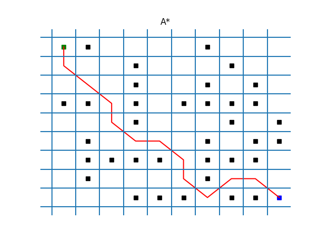

# Motion_planning_and_control_demos
<!-- Badges -->

  
  
  
  

In this Repo, we practice the classical motion planning and control algorithm mainly in C++, (partially in Python).

This repo is for experienced engineers or researchers who already understood 
- **Search-based Planning** (BFS, DFS)
- **Sampling-based Planning**
- **Optimization-based Planning**

But have been interested in the implementation of them in C++.

Different **data structures** will be investigated 

Different **algorithms** setup will be investigated

regarding to **time complexity** and **space complexity**.

### A Star

### Hybrid A Star

### RRT

### Dynamic RRT

### Model Predictive Planner

### A Project (CARLA)

### Contributors:
- Yu Zheng (ZYblend)
- Naveen Kumar Rajarajan (Naveenkumarar)
