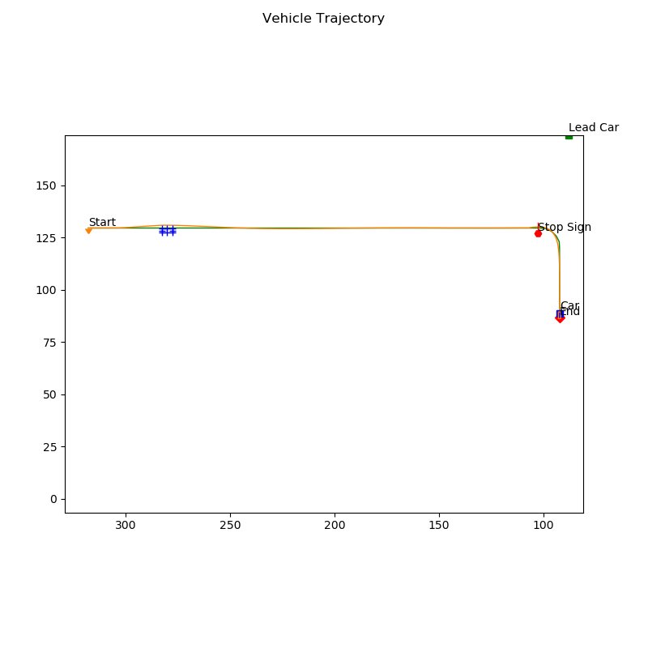
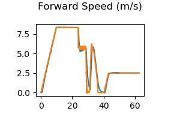
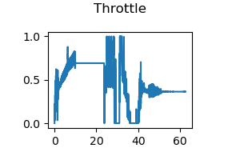
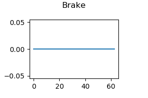

## Coursera Motion Planning CARLA Demo

### Description
This planning scheme contains several parts:
- **Behaviour Planner**:<br>
  Finite State Machine for Intersection scenario (```behavioural_planner.py```)<br>
  Three modes: Fellow lane, Decelerate to stop, Stay stopped
- **Reactive path planner**:<br>
  Polynomial Spirals planner (```path_optimizer.py```) + Comforting Lattice Planner (```collision_checker.py```)
- **Velocity profile Generator**:<br>
  Trapezoidal Profile + Linear ramp profile (```velocity_planner.py```)
  ```
  There is a bug outside the TODO sessions (line 235):
  Modify from
  vi = calc_final_speed(vf, -self._a_max, dist)
  to
  vi = calc_final_speed(vf, self._a_max, dist)
  ```
- **Velocity controller**: <br>
PID longitudinal controller + Stanley lateral controller  (```controller2d.py```)

### How to Use
- Download [CARLA package](https://fsu-my.sharepoint.com/:f:/g/personal/yz19b_fsu_edu/EhHrThCTObVKowsBImVI42UBUpeegCX419u1zcoZtjdDyw?e=DI9y3P)
- Install all python dependencies <br>
(CARLA works with python 3.5.x, 3.6.x, please install it, no need to uninstall your current python version, use command ```py -3.6 -m <commands>``` to indicate you want to use python 3.6.x)
```
py -3.6 -m pip install numpy --user
py -3.6 -m pip install -r <Path-to>\CarlaSimulator\requirements.txt --user
```
- Test CARLA: please refer to the document in the package you just downloaded
- Run simulation <br>
1. Clone this repo to ```<Path-to>\CarlaSimulator\PythonClient```:<br<
```
git clone https://github.com/ZYblend/Motion_planning_and_control_demos.git Motion_planning_demos
```
2. In the folder ```<Path-to>\CarlaSimulator```, open terminal, run commands:
```
cd <Path-to>\CarlaSimulator
.\CarlaUE4.exe /Game/Maps/Course4 -windowed -carla-server -benchmark -fps=30 -Resx=1280 -Resy=720
```
Change ```Resx, Resy``` based on your monitor resolution, they are resolution of the Carla window. 

3. In the folder ```<Path-to>\CarlaSimulator\PythonClient\Motion_planning_demos\motion_planning_coursera```, open terminal, run commands:
```
cd <Path-to>\CarlaSimulator\PythonClient\Motion_planning_demos\motion_planning_coursera
py -3.6 -m module_7
```

### Results

- Trajectory: <br>
  
- Speeds: <br>

- Steering angles: <br>

- Throttle commands: <br>

- Brake commands: <br>


